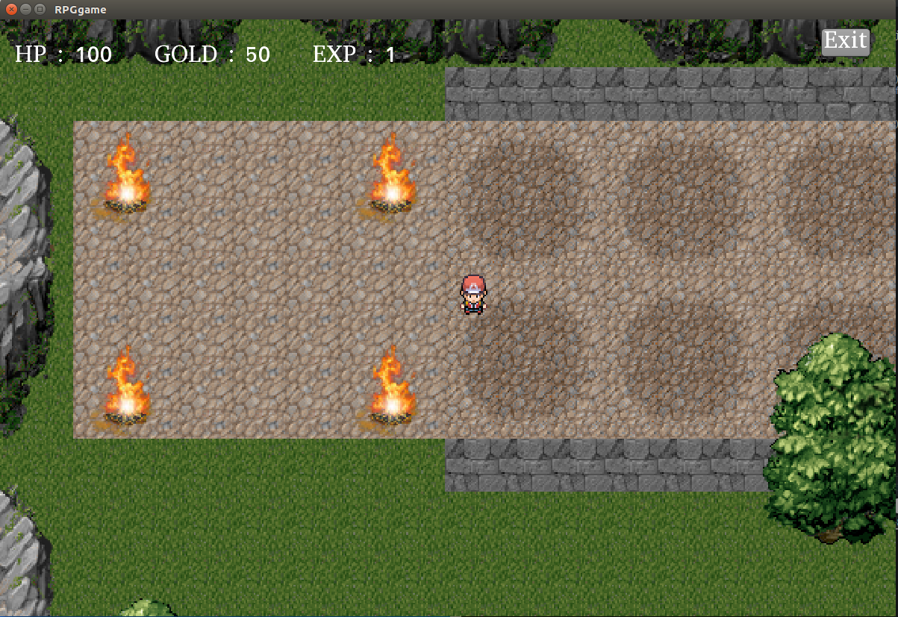

# rpg-game

University project. Game written in LibGDX framework with @paawelosinski

## How to open
* `git clone` or download zip package
* in IDE import existing Gradle project
  * use terminal `./gradlew desktop:run`
  * run DesktopLauncher as Java Application

## Our page 

[Link to page](https://paawel97.webd.pro/index.php)

## Screenshot from game

